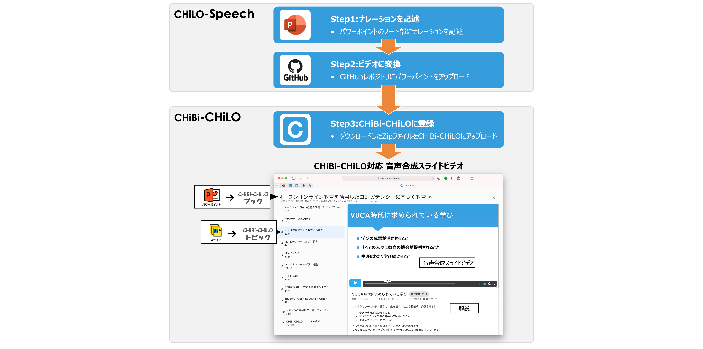
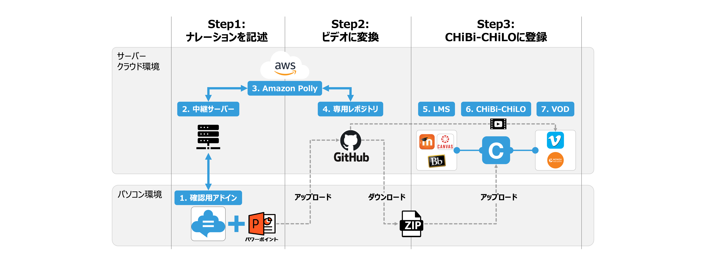

# CHiLO-Speech

## 1. Introduction

### (1) CHiLO-Speechとは
CHiLO-Speechは，[学習支援システムCHiBi-CHiLO](https://github.com/npocccties/chibichilo)に対応した，音声合成ビデオ作成ツールです．

マイクロソフト社製パワーポイントにナレーション原稿を記載し，GitHubのCHiLO-Speechレポジトリにアップロードすると，CHiBi-CHiLOに対応した合成音声付きビデオ教材が作成できます．



### (2) 合成音声付きビデオ教材作成手順

CHiLO-Speechを利用してビデオ教材を作成する手順は次の通りとなっています．

* __Step1：__ パワーポイントにナレーションを記述する．
* __Step2：__ パワーポイントをGithubにアップロードし，CHiBi-CHiLO登録データを入手する．
* __Step3：__ GitHubからダウンロードしたデータをCHiBi-CHiLOに登録する．

ビデオ教材作成手順の詳細は，[CHiLO-Speechマニュアル](https://docs.cccties.org/chilospeech/)　をご覧下さい．

### (3) CHiBi-CHiLOとは

CHiBi-CHiLOとは，Moodle，Blackboard，CanvasLMS等の[LTI](https://www.imsglobal.org/activity/learning-tools-interoperability) 準拠LMSと外部接続する学習支援システムです．ビデオを共有・再利用することを目的に開発されました．

YoutubeやVimeoなどのインターネット上のビデオを管理し，それらを組み合わせ，「ブック」と呼ばれる形式のビデオ教材として配信することができます．

CHiBi-CHiLOの詳細は[CHiBi-CHiLO  Documentation](https://npocccties.github.io/chibichilo/)をご覧下さい．

### (4) WASM版Webアプリ

WASM版Webアプリについては、[wasm-app](wasm-app/)を参照してください。

## 2. Architecture

### (1) システム構成

CHiLO-Speechのシステム構成は，以下の通りです．

1. 確認用アドイン　([manifest](manifest))
    *  パワーポイントに記述するナレーション原稿を確認するパワーポイントのアドインです．
2. 中継サーバー　([ppt-addin-vue](ppt-addin-vue/)，[server](server))
    *  確認用アドインとAmazon pollyを中継するサーバーです．
3. Amazon Polly　(https://aws.amazon.com/jp/polly/)
    * AWSが提供するTTS（Text-to-Speech）エンジンのクラウドサービスです． あらかじめ，アクセスキーが必要です．
4. GitHub専用レポジトリ (本レポジトリ)
    * 本レポジトリです．GitHub Actionsにより，アップロードしたパワーポイントをCHiBi-CHiLO登録データ（ZIP）に変換します．
5. LMS
    * CHiBi-CHiLOのビデオ教材を配信するLTI準拠LMS（Learning Management Service）です．
6. CHiBi-CHiLO　(https://github.com/npocccties/chibichilo)
    * GitHub専用レポジトリからダウンロードした登録データをCHiBi-CHiLOに登録すると，ビデオ教材としてLMSで配信できます．
7. VODサーバー
    * CHiBi-CHiLOでは，Youtube,Vimeo,Wowzaの3種類のVODサービスを利用できます．CHiLO-Speechでは，そのうちVimeo,Wowzaへビデオを登録することが可能です．
8. WASM版Webアプリ
    * ブラウザで音声合成ビデオを作成するWebアプリです。




### (2) 本リポジトリの構成

```
/
+ README.md このファイル
+ docs/spec/ 仕様書置き場
  + access.md アクセス制限機能について
  + import.md pptとマイクロコンテンツ のデータ項目のすり合わせなど。
+ ppt-addin-vue/ アドイン本体
+ server/ アドインを配布するサーバ兼 AWS Polly proxy
+ sample-login/ アクセス制限機能開発用サンプルプログラム
+ ppt2video/ パワーポイントを動画に変換するnode.jsプログラム
+ wasm-app/ WASM版Webアプリ
+ test/ テスト用パワーポイントファイル
+ misc/ サンプルスクリプト、ファイルなど
+ manifest/ アドインをパワーポイントに登録するために必要なmanifestファイル
+ work/ パワーポイントをアップロードすると，合成音声ビデオ（MP4）とWowza用設定ファイル（JSON）がパッケージ化された，ZIP形式のCHiBi-CHiLO登録データを出力
  + _sample/ ナレーション原稿が記載されたパワーポイントファイルのサンプル
+ upload/ パワーポイントをアップロードするとCHiBi-CHiLO登録データとして，Vimeo用設定ファイルがパッケージ化された，ZIP形式のCHiBi-CHiLO登録データを出力
+ .github/workflows ワークフローファイル
```

### (3) ワークフロー

レポジトリには、次の GitHub Actions ワークフローが定義されています。

|名称|ファイル名|内容|
|---|---|---|
|PPT2VIDEO|ppt2video.yml|test/vuca.pptxファイルを動画に変換する|
|ONPUSH|onpush.yml|mainブランチへのgit pushで動作し、work/ 以下で変更されたパワーポイントをアップロードすると，合成音声ビデオ（MP4）とWowza用設定ファイル（JSON）がパッケージ化された，ZIP形式のCHiBi-CHiLO登録データを出力する|
|VIDEO2VIMEO|video2vimeo.yml|mainブランチへのgit pushで動作し、upload/ 以下で変更されたパワーポイントをアップロードするとCHiBi-CHiLO登録データとして，Vimeo用設定ファイルがパッケージ化された，ZIP形式のCHiBi-CHiLO登録データを出力する．さらに合成音声ビデオ（MP4）をVimeoへ，直接アップロードする．|

PPT2VIDEOワークフローは、Actionsページの Run workflow ボタンから起動します。
